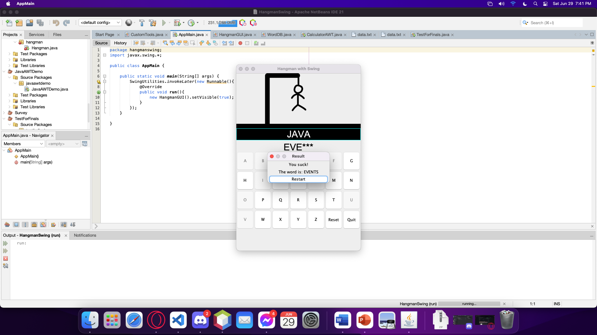

# Hangman with Swing!

**The good old, classic, ~~totally not a dark game~~, Hangman, is now available in Java, serving with AWT and a tad bit of Swing!**

## What is Hangman?

The game where the player guesses the letter of the word with contrast to the number of blank dashes. The letter will appear on the blank dashes if correct, but slowly create a diagram of a hanged man if wrong. If the player filled each of the blanks with letters, the player wins the game. On the other hand, If the diagram of a hanged man gets completed, the player loses the game.

## So, what's so different with this and ordinary Hangman?

This project is served using Java, cooked with packages Abstract Window Toolkit (AWT) and Swing to perfection. And if you notice, the words are related to technology. Isn't that revolutionary?

## I don't believe this. This is all fake!

See for yourself. :)

